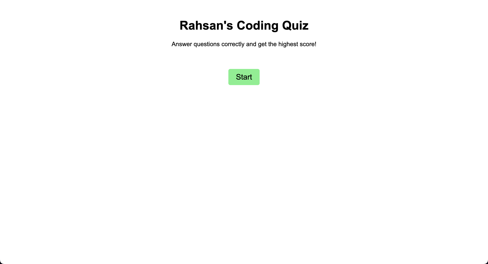

# Rahsans-Code-Quiz


## Description

An online portfolio designed to feature the different webpages i've developed so far in my career.

## Acceptance Criteria

This is the acceptance criteria for the coding quiz:

```
GIVEN I am taking a code quiz
WHEN I click the start button
THEN a timer starts and I am presented with a question
WHEN I answer a question
THEN I am presented with another question
WHEN I answer a question incorrectly
THEN time is subtracted from the clock
WHEN all questions are answered or the timer reaches 0
THEN the game is over
WHEN the game is over
THEN I can save my initials and score
```

## Installation

Deployment link: https://rahsanlewis.github.io/Rahsans-Code-Quiz/

## Usage

Answer javascript questions to get the highest score.



## Credits

Rahsan Lewis

## License

MIT License